# 🚀 Smart Socket Service

Welcome to the Smart Socket Service, your one-stop shop for controlling and monitoring smart sockets. This service is like a remote control for your smart sockets, but with superpowers! 💪

## Usage Scenario

One scenario for the usage of the smart-socket service is illustrated in the following diagram:

## 🌐 API Endpoints

### `GET /api/instance/:instanceId`

This endpoint allows you to check on a specific instance.

| Parameter    | Type   | Optional | Description                               |
| ------------ | ------ | -------- | ----------------------------------------- |
| `instanceId` | string | No       | The ID of the instance you want to check. |

#### Response

You'll get a JSON object with all the details of the instance. The instance object is defined in the [store.ts](src/store.ts) file.

### `POST /api/instance`

This endpoint allows you to create a new instance.

| Parameter              | Type   | Optional | Default | Description                                                        |
| ---------------------- | ------ | -------- | ------- | ------------------------------------------------------------------ |
| `emergencyStopTimeout` | number | No       | `null`  | The timeout used to stop the instance in case it becomes untracked |

#### Response

- 409 Conflict: The instance could not be created.
- 422 Unprocessable Entity: The `instanceId` parameter was not provided.
- 500 Internal Server Error: An error occurred while managing the socket or fetching the power consumption.
- 200 OK: The instance was successfully created.

  - | Parameter          | Type                              | Description                                                                  |
    | ------------------ | --------------------------------- | ---------------------------------------------------------------------------- |
    | `triggeredPowerOn` | boolean                           | Boolean if the creation of this instance triggered a power on for the socket |
    | `instance`         | [`InstanceData`](src/store.ts#L7) | The instance that was newly created                                          |

### `PUT /api/instance/:instanceId`

This endpoint allows you to stop an instance.

| Parameter    | Type   | Optional | Description                              |
| ------------ | ------ | -------- | ---------------------------------------- |
| `instanceId` | string | No       | The ID of the instance you want to stop. |

#### Response

- 422 Unprocessable Entity: The `instanceId` parameter was not provided.
- 409 Conflict: The instance could not be stopped.
- 500 Internal Server Error: An error occurred while stopping the instance.
- 200 OK: The instance was successfully stopped. The response body contains the instance ID, whether the stop triggered a power off, and whether the stop was the last emergency stop.

  - | Parameter           | Type                              | Description                                                            |
    | ------------------- | --------------------------------- | ---------------------------------------------------------------------- |
    | `triggeredPowerOff` | boolean                           | Boolean stopping of this instance triggered a power off for the socket |
    | `instance`          | [`InstanceData`](src/store.ts#L7) | The instance that was newly created                                    |

### `DELETE /api/instance/:instanceId`

This endpoint allows you to delete an instance.

| Parameter    | Type   | Optional | Description                                |
| ------------ | ------ | -------- | ------------------------------------------ |
| `instanceId` | string | Yes      | The ID of the instance you want to delete. |

#### Response

You'll get a JSON object confirming the deletion of the instance. The instance object is removed from the `instancesData` object in the [store.ts](src/store.ts) file.

### `GET /api/wait`

This endpoint allows you to wait for a specific duration.

| Parameter  | Type   | Optional | Description                                |
| ---------- | ------ | -------- | ------------------------------------------ |
| `duration` | number | No       | The duration you want to wait, in seconds. |

#### Response

You'll get a JSON object confirming that the wait has started.

### `POST /api/emergency-stop/:instanceId`

This endpoint allows you to perform an emergency stop on an instance.

| Parameter    | Type   | Optional | Description                              |
| ------------ | ------ | -------- | ---------------------------------------- |
| `instanceId` | string | Yes      | The ID of the instance you want to stop. |

#### Response

You'll get a JSON object confirming the emergency stop. The `isEmergencyStopped` field of the instance object in the [store.ts](src/store.ts) file is set to `true`.

### `GET /api/download`

This endpoint allows you to download the server's state retrieving both the `serverData` under `server` and the `instancesData` under `instances`.

## 🎛️ Handlers

Handlers in this project are responsible for processing specific actions related to instances and sockets. They are located in the `src/handlers` directory.

### Instance Handlers

Instance handlers are located in `src/handlers/instance`. They include:

- [`deleteInstance`](src/handlers/instance/deleteInstance.ts): This handler is responsible for deleting an instance.
- [`startInstance`](src/handlers/instance/startInstance.ts): This handler is responsible for starting an instance.
- [`stopInstance`](src/handlers/instance/stopInstance.ts): This handler is responsible for stopping an instance.

### Socket Handlers

Socket handlers are located in `src/handlers/socket`. They include:

- [`control`](src/handlers/socket/control.ts): This handler is responsible for sending control commands to the socket. It includes `startSocket` and `stopSocket` functions.
- [`emergencyStop`](src/handlers/socket/emergencyStop.ts): This handler is responsible for performing an emergency stop on the socket.
- [`manualStop`](src/handlers/socket/manualStop.ts): This handler is responsible for performing a manual stop on the socket.
- [`powerMonitor`](src/handlers/socket/powerMonitor.ts): This handler is responsible for monitoring the power usage of the socket.

Each handler interacts with the [`store`](src/store.ts) to get or update the data of instances and sockets.

## 📚 Data Store

The application uses a simple in-memory data store to keep track of instances and server data. The data store is defined in the [store.ts](src/store.ts) file.

### Instance Data

The application keeps track of instances data in the `instancesData` object in the [store.ts](src/store.ts) file. Each instance is represented by an `InstanceData` object, which contains the following fields:

| Field                  | Type                                   | Description                                                                                                                               |
| ---------------------- | -------------------------------------- | ----------------------------------------------------------------------------------------------------------------------------------------- |
| `id`                   | string                                 | The ID of the instance.                                                                                                                   |
| `energy`               | [InstanceDataEnergy](src/store.ts#L10) | The energy object queried from the device at the start of the instance.                                                                   |
| `amperagePerSecond`    | number[]                               | Amperage report per interval.                                                                                                             |
| `emergencyStopTimeout` | number                                 | The time in milliseconds after which the device will be stopped if it is not stopped manually.                                            |
| `startTimestamp`       | Date                                   | Timestamp when the instance was started.                                                                                                  |
| `stopTimestamp`        | Date                                   | Timestamp when the instance was stopped. Might be `null` if the instance is still running.                                                |
| `powerOnTimestamp`     | Date                                   | Timestamp when the socket was powered on.                                                                                                 |
| `powerOffTimestamp`    | Date                                   | Timestamp when the socket was powered off. Might be `null` if the socket is still handling other instances yet this instance has stopped. |
| `isEmergencyStopped`   | boolean                                | Flag indicating if the instance was stopped due to an emergency stop.                                                                     |
| `isManuallyStopped`    | boolean                                | Flag indicating if the instance was stopped manually.                                                                                     |

### Server Data

The application also maintains a `serverData` object in the [store.ts](src/store.ts) file. This object contains data related to the server and its interactions with instances and sockets. Here are the fields in the `serverData` object:

| Field                                  | Type          | Description                                                                                                                                                                                                                          |
| -------------------------------------- | ------------- | ------------------------------------------------------------------------------------------------------------------------------------------------------------------------------------------------------------------------------------ |
| `runningInstances`                     | string[]      | An array of instance IDs that are currently running.                                                                                                                                                                                 |
| `instancesStopping`                    | string[]      | An array of instance IDs that are currently triggering a power off command.                                                                                                                                                          |
| `latestEmergencyStopTimeoutInstanceId` | string        | The ID of the instance that last triggered an emergency stop timeout.                                                                                                                                                                |
| `powerStatus`                          | PowerStatus[] | An array of `PowerStatus` objects representing the power status of the server. Each `PowerStatus` object contains a `powerOn` field and a `powerOff` field, each of which is an object containing an `instanceId` and a `timestamp`. |

The `serverData` object is updated by various handlers in the `src/handlers` directory. For example, the [`startInstance`](src/handlers/instance/startInstance.ts) handler adds the started instance's ID to the `runningInstances` array, and the [`stopInstance`](src/handlers/instance/stopInstance.ts) handler removes the stopped instance's ID from the `runningInstances` array and adds it to the `instancesStopping` array.

## 🛠️ Installation

Just clone this repository, run `npm install` to install the dependencies, and you're good to go!

## 🎮 Usage

To start the service, just run `npm start`. To run in development mode, use `npm run dev`.

## 🤝 Contributing

We welcome contributions! Feel free to submit a pull request.

## 📜 License

This project is licensed under the ISC License.

So, what are you waiting for? Start controlling your smart sockets like a pro! 🎉
